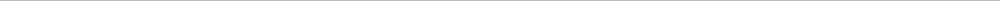

# VLM Architectures
___

Vision Language Models (VLMs) essentially combine computer vision or vision transformer and Natural Language Processing to contextualize using an intermediary shared embedding space of vision and natural language to generate text and or image.
The architecture of a VLM generally speaking consists of three main components: a **Vision Encoder**, a **Text Encoder/Decoder**, and a **Multimodal Fusion** mechanism.

The architectural differences arise from when the visual and textual features are fused.  

## 1. Dual-Encoder Architectures (Late Fusion)

## CAD Transformer
Its core idea is to treat a CAD model, often represented as a sequence of features or operations (e.g., *sketch circle*, ) as a `sentence` or a sequence of `tokens` that the model can learn to understand and generate.

## Important Architectural Features:
- Localized Attention (Mask2Former -- uses SWIN Transformer)
- Segmentation - Unified segmentation by combining the following segmentations:
    - Panoptic Segmentation
    - Semantic Segmentation
    - Object Segmentation
    - Pixel Segmentation
    - Instance Segmentation
### Few pointers to the architecture:
- The research papers around mainly cover the DL architectures around SWIN (Hierarchical Attention) and DETR -- (DETR) -- End to End Object Detection Transformer. DETR is for combining the segmentations into one architecture and these two are used well by Mask2Former which adds in the concept of Binary Masks i.e. N binary masks for N pixel segments in a image.
- Company's Microsoft and Meta, the creators of SAM (1,2,3) and Florence have created the SWIN and Mask2Former, possibly building up and refining from the core architectures.
- Especially the ability to combine all types of segmentations into one DL architecture is also achieved through N-Segments Binary Masks and the corresponding N Categories.

### How the CAD Transformer looks at a DXF

## Vectorized Image to CAD- DXF vs. PNG:
___

1. Vector Input: DXF(Geometric Sequence)
The **DXF** (Drawing Exchange Format) is the ideal input because it retains the original, structured, and symbolic nature of the CAD drawing. 

|Concept |Vector Input (DXF) |CAD Transformer Treatment |
|------- |------------------- |------------------------- |
|**Data Structure** |A sequence of geometric entities (lines, arcs, polylines) and their parameters (coordinates, layer names, line types). |This is the "sentence" for the model. |
|**Tokenization** |Each entity and its parameters become tokens. For example: `[LINE_START]`, `(X1,Y1)`,`(X2,Y2)`, `[LAYER_WALL]`,`[LINE_END]` |The model learns the **grammar** and **syntax** of the CAD language. |
|**Input Embedding** |Tokens are mapped to dense vectors. The embedding must capture the type of entity (a door, a window, a wall) and the geometric values (coordinates) |Requires a specialized embedding layer to handle both **categorical** (entity type) and **numerical** (coordinates/dimensions) data. |
|**Advantages ** |Editability & High Fidelity. The model learns to generate ediatble CAD files, not just images. Preserves topology (e.g., this line connects to that line) |  | 

### Specialized Vector Representation
For a building plan, the model often uses a **structured sequence** based on the operations or based on the entities:

    1. **Operation-based**: The sequence of commands needed to create the drawing (e.g.,`SKETCH_RECTANGLE`, `EXTRUDE` )
    2. **Entity-based**: A list of every geometric elements and its properties, ordered by a spatial or proedural logic.

    Input Sequence = {Entity_1, Entity_2,..., Entity_N}
where Entity_i is a vector incorporating its type, coordinates, and layer/class information.

2. Raster Input: PNG (Image Grid)

If the DXF is converted to a PNG (a raster image), the data loses its symbolic meaning. The transformer must now perform **Reverse Engineering** to infer the geometric structure from the image.
|Concept |Raster Input (PNG) |CAD Transformer Treatment |
|Data Structure |A 2D array of pixels (a grid). The lines and symbols are just colored pixels. |This is the raw image data |
|Pre-Processing |Vision Transformer (ViT) or CNN Backbone. The image is first split into non-overlapping patches. These patches are flattened and linearly embedded. |An entirely separate visual network is needed before the main Transformer Encoder |
|Input to Encoder |Image Patch Embeddings. These embeddings, combined with 2D positional encodings, are fed into the standard Transformer Encoder. |The Encoder learns to understand the *spatial relationships* (e.g., this corner connects these two walls) directly from the pixel data. |
|Decoder Task |The Decoder is still trained to generate the vectorized output (the sequence of DXF-like tokens) that corresponds to the image. | -- | 

The choice between the two is crucial: **Vector Input (DXF)** treats the drawing as **code** to be generated, while **Raster Input (PNG)** treats the drawing as an image from which code must be extracted.

## SAM for CAD Drawings: Segmentation to Vectorization
SAM is a foundational model for **image segmentation**. It takes a natural image and can generate high-quality **segmentation masks** for virtually any object, often in a "zero-shot" manner (without specific training for that object).

## Specific case of finalizing for CAD
___

3D point cloud is a fundamental data type for CAD, specifically serving as the input for reverse engineering and **as-built modeling**.

While traditional CAD models (like DXF or STEP files) are **symbolic** and **parametric**, a point cloud is a raw measurement of a physical object or environment.

### Point Cloud to CAD: Reverse Engineering:
___

The primary way point clouds relate to CAD is through **Reverse Engineering**. This is the process of converting the raw point data into a structured, editable, and parametric CAD model.

1. **The Need for Conversion**:

CAD models (saved in DXF, DWG or STEP) are better suited for design work because they consist of **editable geometric primitives** (lines, arcs, planes, cylinders) and a **feature history** (extrude, cut, fillet).
A Point Cloud on other other hand is just a 3D representation of the physical world with some annotation like temperature

2. **The Conversion Process**

|Step |Description                |Goal                  |
|------|--------------------------|-----------------------|
|**Segmentation** |Grouping adjacent points into **clusters** that represent geometric faces or surfaces (e.g., a flat patch of points is segmented as a wall). |Identify individual features |
|**Primitive Fitting** |Fitting an **analytical surface primitive** (like a plane, cylinder, sphere or cone) to each segmented cluster. |Convert raw points into mathematically defined CAD entities. |
|**Topology Extraction** |Identifying the **edges and corners** where these fitted primitives intersect. This defines the final shape boundaries. |Determine the CAD model's structure |
|**CAD Sequence Generation** |Creating the final sequence of operations** (e.g., `SKETCH_RECTANGLE`, `EXTRUDE`, `FILLET`) that, when executed in a CAD program, reconstruct the object. |Generate teh *symbolic* code that the CAD Transformer is trained on. |                      
